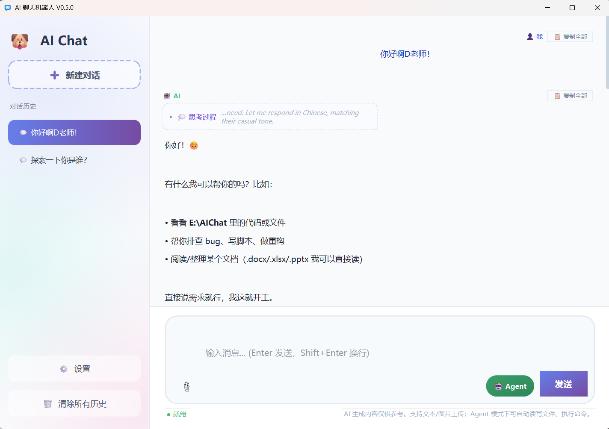

# AI Chat Bot

一款 Vibe Coding 搓出来的简易 AI 聊天窗口界面，基于 PySide6 制作，**零 SDK 依赖**（纯标准库 HTTP 客户端），
原生支持 **Anthropic Messages** 与 **OpenAI Responses** 两种 API 格式，内置 **Agent 工具调用**，还有一只通体乌黑、金瞳圆眼、会蜷睡、奔跑、犯困的可爱玄猫桌宠 🐈‍⬛。



## ✨ 功能特性

### 🎨 现代化界面
- 优雅的浅色主题设计（左侧深色导航栏，全局固定浅色不随系统切换）
- 流畅的动画效果和圆角设计
- 响应式布局，支持窗口缩放

### 🔌 双格式 API（无 SDK 依赖）
- **Anthropic (Messages)**：`POST {Base URL}/v1/messages`，`x-api-key` + `anthropic-version` 认证
- **OpenAI (Responses)**：`POST {Base URL}/responses`，`Bearer Token` 认证
- 两种格式均为原生 **SSE 流式** 实现（`urllib` + 标准库 JSON），彻底移除 `openai` 包依赖
- 多模态（图片）消息在两种格式间自动转换

### 🤖 Agent 与工具调用
- 输入框旁的 "🤖 Agent" 开关一键启用
- 模型可调用 6 个工具：`read` / `write` / `edit` / `glob` / `grep` / `bash`（参考 nanocode 设计）
- 完整 agentic 循环：模型请求工具 → 后台执行 → 结果回传 → 继续推理，直到任务完成
- 工具调用以卡片形式展示在对话流中，点击可展开完整参数与输出
- 写入/编辑/命令类工具默认需要用户确认（可在设置中关闭）
- 工作目录可配置，所有相对路径基于该目录解析

### 💬 对话功能
- 流式响应，实时显示 AI 回复
- 对话历史管理（创建、重命名、删除），本地保存与会话恢复
- 对话标题自动取首条消息前 20 字

### 📁 多模态输入
- **文本输入**：Markdown 渲染与代码高亮
- **图片上传**：PNG、JPG、JPEG、BMP、GIF、WebP，多图支持
- **文件上传**：代码与文本文件自动包装为代码块

### 🐈‍⬛ 玄猫桌宠
- 关闭主窗口时，一只可爱的玄猫出现在桌面右下角
- 多种自然动作：**端坐摇尾、散步、奔跑、犯困点头、蜷成一团打盹（带 Zzz）、伸懒腰**，按随机节奏自动轮换
- 与 AI 任务联动：发送消息后**托腮思考**（冒问号）、执行工具时**埋头刨地干活**、回答完成**跳跃庆祝**（撒星星）、出错时**飞机耳冒汗**；检测到新程序启动时欢快奔跑
- 可拖动到任意位置，点击恢复主窗口，右键菜单可退出

## 📦 安装部署

### 环境要求
- Python 3.9 或更高版本
- 一个兼容 Anthropic Messages 或 OpenAI Responses 格式的 API Key

### 安装步骤

1. **克隆仓库**
```bash
git clone https://github.com/TerryTian-tech/ai-chat-gui.git
cd ai-chat-gui
```
2. **安装依赖**
```bash
pip install -r requirements.txt
```
3. **运行程序**
```bash
python AIChat.py
```

### 运行测试（可选）
```bash
QT_QPA_PLATFORM=offscreen python tests/offline_test.py
```
使用本地模拟 SSE 服务器离线验证双格式客户端与 Agent 循环，无需真实 API Key。

## 🔧 配置说明

首次运行需要在设置中配置 API 信息：

| 配置项 | 说明 | 示例 |
|---|---|---|
| API 格式 | Anthropic (Messages) 或 OpenAI (Responses) | — |
| API Key | 你的 API 密钥 | `sk-...` |
| Base URL | 服务地址（末尾自动补全端点路径） | `https://api.anthropic.com` / `https://api.openai.com/v1` |
| 模型 | 模型名称 | `claude-sonnet-4-5` / `gpt-5` / `deepseek-chat` |
| 多模态 | 模型是否支持图片输入 | 勾选 |
| 工具工作目录 | Agent 工具的默认目录 | `D:\projects\demo` |
| 工具确认 | 写入/编辑/命令前是否弹窗确认 | 默认开启 |

### 常见服务的填法
- **Anthropic 官方**：格式选 Anthropic，Base URL `https://api.anthropic.com`
- **OpenAI 官方**：格式选 Responses，Base URL `https://api.openai.com/v1`
- **DeepSeek（Anthropic 兼容端点）**：格式选 Anthropic，Base URL `https://api.deepseek.com/anthropic`
- **其他兼容服务**：按服务方文档填写；若 Base URL 已以 `/messages` 或 `/responses` 结尾则不会重复追加

### 模型适配注意事项
- **输出上限**：默认请求 384K 输出（`aichat/api.py` 的 `MAX_TOKENS`）。上限较小的模型会返回 400，客户端解析服务端上报的上限后自动收紧并按模型缓存，无需手动调整
- **上下文档位**：设置中可按模型上下文选择 128K / 200K / 1M 档（对应请求携带的历史预算约 10 万 / 16 万 / 80 万字符）。档位选大了会撑爆小上下文模型（超长时客户端会自动减半窗口重试），选小了只是用不满长上下文
- **工具输出**：Agent 单个工具结果最大 5 万字符，超出截断（保留头尾）；`read` 大文件会占用可观的上下文预算
- **思考强度**：档位映射 Anthropic `thinking.budget_tokens`（低 2048 / 中 8192 / 高 16384）；模型不支持思考时自动去掉该参数

## 🖥️ 使用指南

### 基本使用
1. **新建对话**：点击左侧面板的 "➕ 新建对话"
2. **发送消息**：输入框输入文本，`Enter` 发送，`Shift+Enter` 换行
3. **上传文件**：点击 "📎" 按钮多选图片或文本文件

### Agent 模式
1. 点击输入框旁的 **"🤖 Agent"** 按钮开启（按钮变绿）
2. 像平时一样对话，例如：
   - "看看当前目录有什么文件，把 README 里的版本号改成 2.0"
   - "写一个 fizzbuzz.py 并运行它"
3. 工具调用会以卡片出现在对话流中，点击卡片可展开参数与结果
4. 默认在执行 `write` / `edit` / `bash` 前会弹窗询问（设置中可改为自动执行）
5. 生成过程中发送按钮会变为 **"⏹ 停止"**，点击可随时中断

> ⚠️ **安全提示**：`bash` 工具通过 shell 执行任意命令；工具路径也允许绝对路径（不局限于工作目录）。请仅在可信环境下使用 Agent 模式，谨慎关闭"工具确认"弹窗，并注意 API Key 存储于本机（QSettings 明文保存）。

### 对话管理
- **切换/重命名/删除**：点击或右键左侧列表项
- **清除历史**：左下角 "🗑️ 清除所有历史"

## 📁 项目结构

```
ai-chat-gui/
├── AIChat.py              # 启动入口
├── aichat/
│   ├── api.py             # 双格式 API 客户端（urllib + SSE 流式）
│   ├── agent.py           # 工具集 + AgentWorker agentic 循环
│   ├── pet.py             # 玄猫桌宠（多动作状态机 + QPainter 绘制）
│   ├── widgets.py         # Markdown/消息/代码块/工具调用组件
│   ├── window.py          # 主窗口、设置、进程监控
│   └── app.py             # QApplication 入口
├── tests/
│   └── offline_test.py    # 离线端到端测试（模拟 SSE 服务器）
└── ~/.aichat/conversations.json   # 用户数据（自动创建）
```

## 🛠️ 技术实现

### 核心架构
- **UI 框架**: PySide6 (Qt for Python)
- **API 客户端**: Python 标准库 `urllib`（零第三方 SDK），SSE 事件流解析
- **Agent 循环**: QThread 后台执行「模型 ↔ 工具」迭代，信号驱动 UI 更新
- **数据存储**: JSON 格式本地存储（内部消息格式统一为 Anthropic 风格内容块，旧版历史自动迁移）

### 关键特性实现
1. **双格式流式**：Anthropic `content_block_delta` 与 OpenAI `response.output_text.delta` 统一为 `on_text` 回调；工具调用在流结束后以完整形态返回
2. **消息转换**：内部 Anthropic 风格块 ↔ Responses items（`function_call` / `function_call_output` / `input_image`）双向转换
3. **工具安全**：危险工具确认机制跨线程同步（`threading.Event`）；工具输出截断保护上下文
4. **桌宠动画**：单计时器 30fps 驱动，参数化 QPainter 绘制玄猫十种姿态（深色剪影加描边，明暗桌面均可见），状态机随机轮换 + AI 任务状态联动

## 🐛 常见问题

### Q: 程序无法启动
**A**: 检查 Python 版本和依赖安装

### Q: API 请求失败
**A**:
1. 检查 API 格式是否与服务匹配（Anthropic 端点用 Messages 格式，OpenAI 端点用 Responses 格式）
2. 检查 API Key 和 Base URL 是否正确
3. 确认模型名称已正确填写

### Q: Agent 模式下模型不调用工具
**A**: 部分模型不支持工具调用；确认所填模型具备 tool use 能力。

## 📜 开源协议

本项目采用 MIT 协议开源。详见 [LICENSE](LICENSE) 文件。
